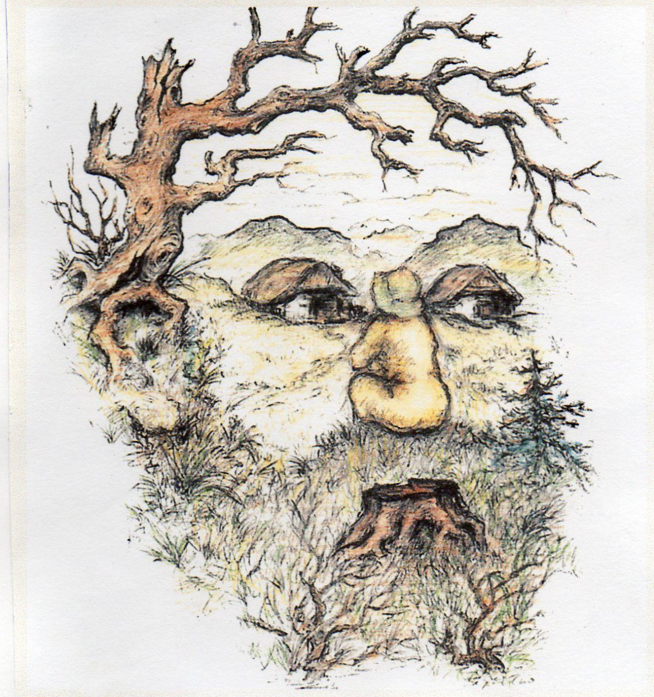
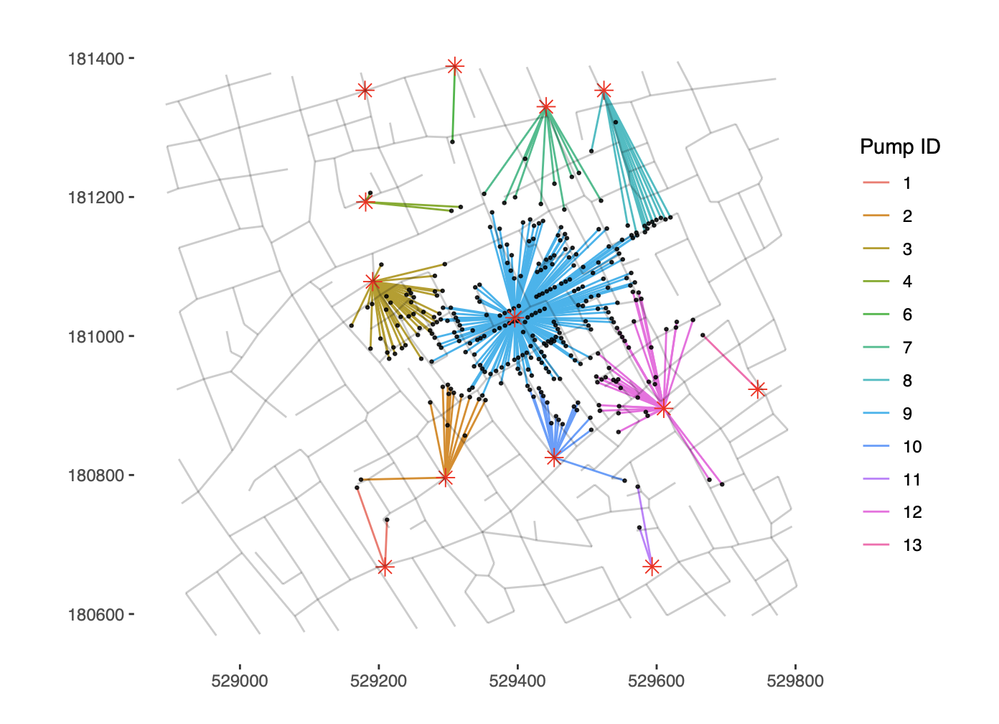
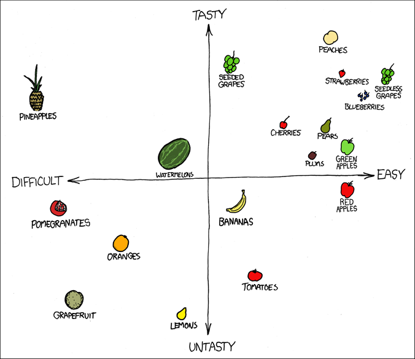
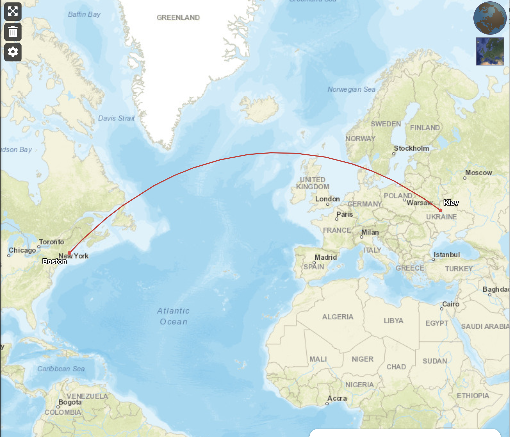
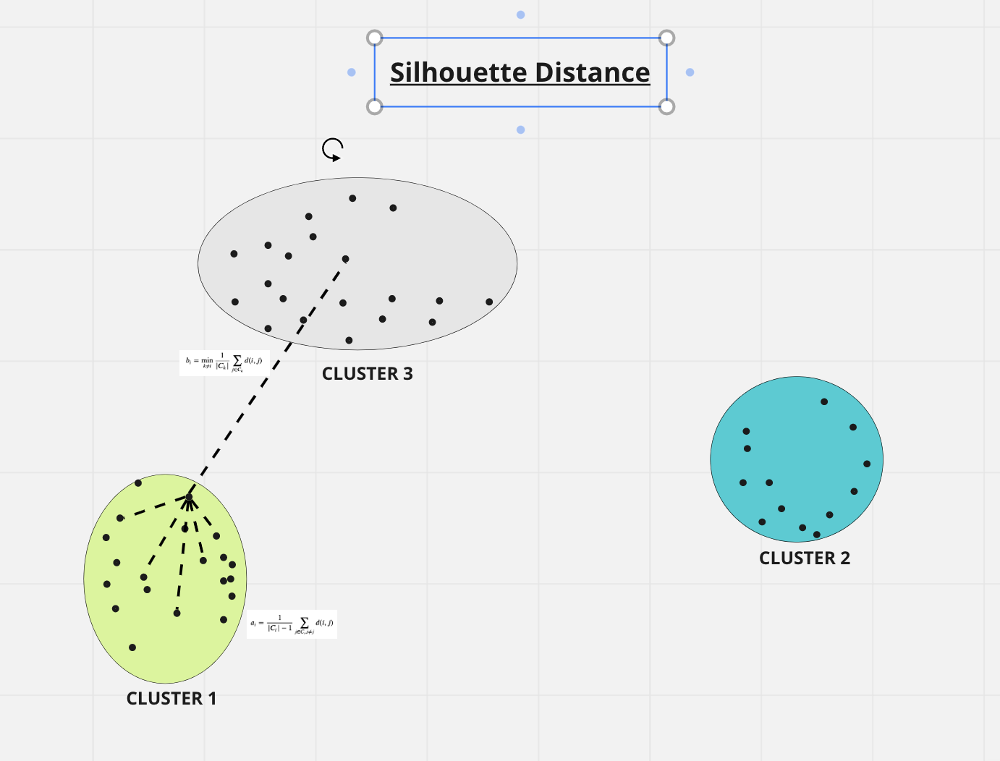
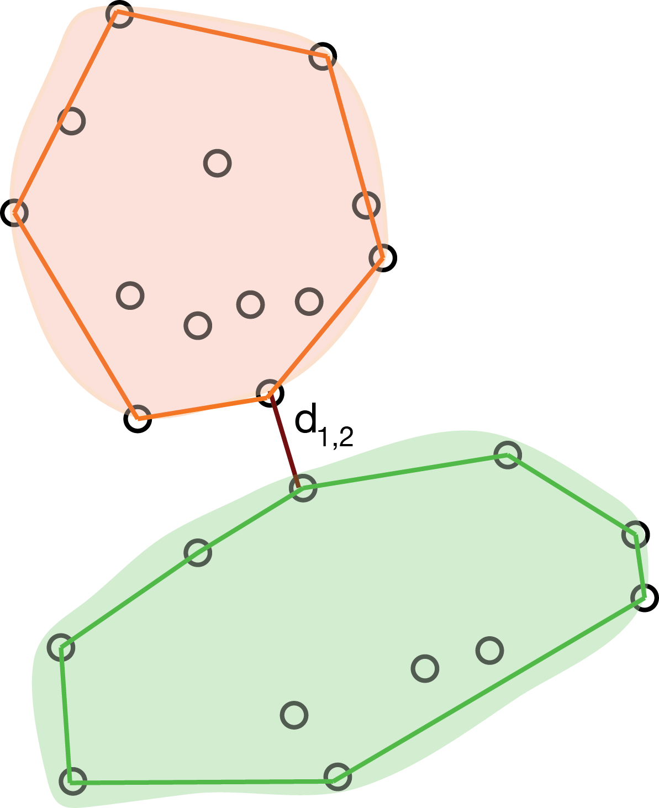
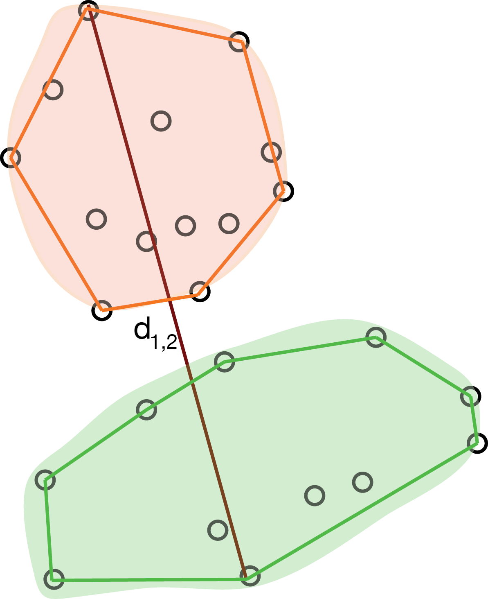
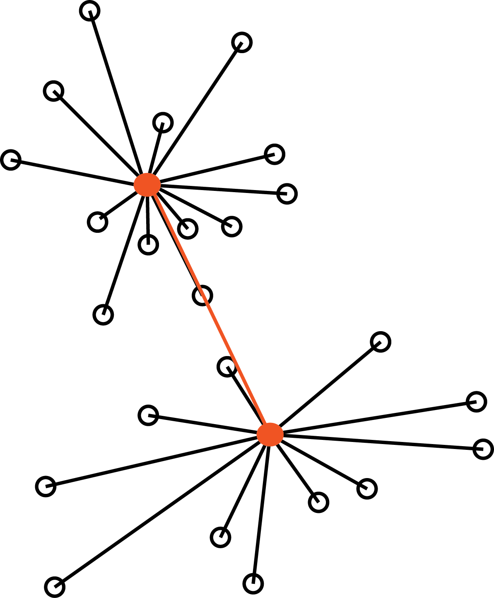

## What do you see?

{fig-align="center"}

## Clustering as a discovery tool

::: {.columns}
::: {.column width="40%"}
In 1855, the English physician John Snow made a map
of cholera cases and identified spatial _clusters_ of cases.
:::
::: {.column width="60%"}
{width="100%"}
:::
:::

## Clustering as a discovery tool

::: {.columns}
::: {.column width="40%"}
Assign each case to the nearest pump $\Rightarrow$ <br>
Broadstreet pump stands out $\Rightarrow$ <br>
Source of the cholera outbreak.
:::
::: {.column width="60%"}
{width="100%"}
:::
:::

## Intuition of clustering

::: {.columns}
::: {.column width="40%"}
We try to group together **similar** observations.<br>
But what do we mean by similarity?<br><br>
Are the rows or the columns more similar to each other?
:::
::: {.column width="60%"}

:::
:::

## Distance as dissimilarity

::: {.columns}
::: {.column width="40%"}
Observations: points in a multi-dimensional 
space<br><br>
Group **similar** observations.<br><br>
Measure of similarity: inverse of distance<br>
(So what we only really need is a metric space.)
:::
::: {.column width="60%"}

:::
:::

## Euclidean distance

```{r}
library("ggplot2")
theme_set(theme_minimal(base_size = 20))

# Define two points
p1 <- data.frame(x = 1, y = 1)
p2 <- data.frame(x = 4, y = 3)

# Data for segments (horizontal, vertical, and diagonal)
segments <- data.frame(
  x = c(p1$x, p2$x, p1$x),
  y = c(p1$y, p1$y, p1$y),
  xend = c(p2$x, p2$x, p2$x),
  yend = c(p1$y, p2$y, p2$y),
  type = c("a", "b", "distance")
)

ggplot() +
  geom_point(data = rbind(p1, p2), aes(x, y), size = 3) +
  geom_segment(data = segments,
               aes(x = x, y = y, xend = xend, yend = yend, linetype = type),
               linewidth = 1) +
  annotate("text", x = p1$x, y = p1$y - 0.2, label = "x") +
  annotate("text", x = p2$x, y = p2$y + 0.2, label = "y") +
  annotate("text", x = (p1$x + p2$x)/2, y = p1$y - 0.3, label = "y2 - x2") +
  annotate("text", x = p2$x + 0.2, y = (p1$y + p2$y)/2, label = "y1 - x1") +
  coord_equal() +
  labs(x = "var 1", y = "var 2") +
  scale_linetype_manual(values = c("dashed", "dashed", "solid")) +
  theme(legend.position = "none")
```

$$
d(x, y)^2 = (y_1 - x_1)^2 + (y_2 - x_2)^2.
$$

## But it's more complex than that

::: {.columns}
::: {.column width="40%"}
- Do we need all variables? Or which subset?
- Should they all contribute equally?
- Do we need to transform the variables?
- Which distance should I use? 

- Why don't they fly a straight line?
- Is Greenland really so much larger than Algeria?
:::
::: {.column width="60%"}

:::
:::

## Example: flow cytometry

::: {.columns}
::: {.column width="40%"}
::: {style="font-size: 0.7em;"}
Example data: 91,392 cells with 41 markers.

- all mature T cells: CD3
- helper T cells: CD4.  But CD4 also on monocytes, macrophages, dendritic ...
- We can isolate CD4+ T cells by clustering
:::
:::
::: {.column width="60%"}
```{r}
#| label: flow
#| fig-width: 4
#| fig-height: 4
#| out-width: "100%"
library("flowCore")
library("flowViz")
fcsB = read.FCS("Bendall_2011.fcs", truncate_max_range = FALSE)
markersB = readr::read_csv("Bendall_2011_markers.csv")
mt = match(markersB$isotope, colnames(fcsB))
stopifnot(!any(is.na(mt)))
colnames(fcsB)[mt] = markersB$marker
asinhtrsf = arcsinhTransform(a = 0.1, b = 1)
fcsBT = transform(fcsB, transformList(colnames(fcsB)[-c(1, 2, 41)], asinhtrsf))
flowPlot(fcsBT, plotParameters = c("CD3all", "CD4"), logy = FALSE)
```
:::
:::

## Flow cytometry (first 10 cells)

```{r}
library("ggrepel")
top10 = as.data.frame(exprs(fcsBT)) |>
  dplyr::select(CD3all, CD4) |>
  head(n = 10) 

ggplot(top10, aes(x = CD3all, y = CD4)) +
  geom_point() +
  geom_text_repel(label = 1:10) +
  coord_equal()
```

## Flow cytometry (first 10 cells) {.smaller}

Compute the distance in R.

```{r}
#| echo: true
dist(top10)
```

## Other distances

Not all data are numbers!

### Text: Hamming, Levenshtein distances

(aka Edit distance) <br>
Number of atomic edit operations needed to make them equal

<pre style="font-family: monospace; font-size: 1em; line-height: 1;">
Reference: <span class="A">A</span><span class="C">C</span><span class="G">G</span><span class="T">T</span><span class="A">A</span><span class="C">C</span>
   HD = 1: <span class="A">A</span><span class="C">C</span><span class="G">G</span><span class="T">T</span><span class="A">A</span><span class="G">G</span>
   HD = 2: <span class="A">A</span><span class="T">T</span><span class="G">G</span><span class="T">T</span><span class="C">C</span><span class="C">C</span>
   HD = 3: <span class="G">G</span><span class="C">C</span><span class="A">A</span><span class="T">T</span><span class="C">C</span><span class="C">C</span>
   HD = 4: <span class="G">G</span><span class="T">T</span><span class="A">A</span><span class="C">C</span><span class="A">A</span><span class="C">C</span>
</pre>

Specialized versions give different weight to different operations: PAM, BLOSUM

## Jaccard index and distance

Appropriate for measuring co-occurence of rare features

$$
J(A, B) = \frac{|A \cap B|}{|A \cup B|}.
$$

Size of the _intersection_ of two sets divided by the size of their _union_.

$$
\text{Jaccard distance: }\quad d(x, y) = 1 - J(x, y).
$$

# Agglomerative vs Partitioning methods

## Partitioning: $k$-means

**The** foundational partitioning-based algorithm

Starts by specifying the desired number of clusters, $k$.

Partition the $n$ observations into $k$ groups, so that **within-group distances are minimized**

Original $k$-means needs points to lie in a vector space. 

Variation $k$-medoids works on just the distance matrix --- does not need features, coordinates, embeddings...

## Combinatorial explosion

Naively, one could try _all possible groups_ and choose the one that minimizes the sum of squares.

However, we have ${n \choose k}$ possible ways to group $n$ observations into $k$ groups.

:::{.callout-note}
${n \choose k} = \frac{n!}{k!(n-k)!}$.

```{r}
#| echo: true
choose(10, 4)
choose(100, 4)
choose(1000, 4)
```
:::

## $k$-means algorithm {.smaller}

1. Initialize $k$ centroids, $\mu_1, \ldots, \mu_k$ (randomly)

2. Assign each observation to its nearest centroid

3. For each group, compute the new centroid (average coordinates of its points)

4. Go to 2.

<!--
## Example: $k$-means

```{r}
#| echo: true
assign_centroids <- function(x, centroids) {
  apply(x, 1, function(xi) {
    which.min(apply(centroids, 1, function(mu) sum((xi - mu)^2)))
  })
}

compute_centroids <- function(x, labels, k) {
  t(vapply(1:k, function(i) colMeans(x[labels == i,]), numeric(ncol(x))))
}
```
-->

## Example: $k$-means {.smaller}

```{r}
#| echo: true
centroids <- top10[1:3, ]   # whatever random choice
centroids
```

```{r}
p_top10 <- ggplot(top10, aes(x = CD3all, y = CD4)) +
  coord_equal() 

p_top10 + 
  geom_point() +
  geom_point(data = as.data.frame(centroids), aes(x = CD3all, y = CD4), color = "red", size = 3) +
  geom_text_repel(data = as.data.frame(centroids), aes(x = CD3all, y = CD4), label = paste0("centroid ", 1:3), color = "red") +
  theme(legend.position = "none")
```

## Example: $k$-means {.smaller}

```{r}
#| echo: true
# assign observations to centroids
labels <- assign_centroids(top10, centroids)
labels
```
```{r}
p_top10 + 
  geom_point(data = cbind(top10, labels=paste0("cluster", labels)), aes(x = CD3all, y = CD4, color = labels)) +
  theme(legend.position = "none")
```

## Example: $k$-means {.smaller}

```{r}
#| echo: true
# compute new centroids
centroids <- compute_centroids(top10, labels, k = 3)
```
```{r}
p_top10 + 
  geom_point() +
  geom_point(data = as.data.frame(centroids), aes(x = CD3all, y = CD4), color = "red", size = 3) +
  geom_text_repel(data = as.data.frame(centroids), aes(x = CD3all, y = CD4), label = paste0("centroid ", 1:3), color = "red") +
  theme(legend.position = "none")
```

## Example: $k$-means {.smaller}

```{r}
#| echo: true
# assign observations to new centroids
labels <- assign_centroids(top10, centroids)
```
```{r}
p_top10 + 
  geom_point(data = cbind(top10, labels=paste0("cluster", labels)), aes(x = CD3all, y = CD4, color = labels)) +
  theme(legend.position = "none")
```

## Example: $k$-means {.smaller}

```{r}
#| echo: true
# compute new centroids
centroids <- compute_centroids(top10, labels, k = 3)
```
```{r}
p_top10 + 
  geom_point() +
  geom_point(data = as.data.frame(centroids), aes(x = CD3all, y = CD4), color = "red", size = 3) +
  geom_text_repel(data = as.data.frame(centroids), aes(x = CD3all, y = CD4), label = paste0("centroid ", 1:3), color = "red") +
  theme(legend.position = "none")
```

## Example: $k$-means {.smaller}

```{r}
#| echo: true
# assign observations to new centroids
labels <- assign_centroids(top10, centroids)
```
```{r}
p_top10 + 
  geom_point(data = cbind(top10, labels=paste0("cluster", labels)), aes(x = CD3all, y = CD4, color = labels)) +
  theme(legend.position = "none")
```

## Example: $k$-means {.smaller}

```{r}
#| echo: true
# compute new centroids
centroids <- compute_centroids(top10, labels, k = 3)
```
```{r}
p_top10 + 
  geom_point() +
  geom_point(data = as.data.frame(centroids), aes(x = CD3all, y = CD4), color = "red", size = 3) +
  geom_text_repel(data = as.data.frame(centroids), aes(x = CD3all, y = CD4), label = paste0("centroid ", 1:3), color = "red") +
  theme(legend.position = "none")
```

## Example: $k$-means {.smaller}

```{r}
#| echo: true
# assign observations to new centroids
labels <- assign_centroids(top10, centroids)
```
```{r}
p_top10 + 
  geom_point(data = cbind(top10, labels=paste0("cluster", labels)), aes(x = CD3all, y = CD4, color = labels)) +
  theme(legend.position = "none")
```

## Randomness of $k$-means

Result is not deterministic --- random initialization of the centroids

<!---
## $k$-means in R

```{r}
#| echo: true

set.seed(2258)
(km <- kmeans(top10, centers = 3, nstart = 10))
```

## The curse of dimensionality

In this simple example, we have only two variables and we can easily compute the distance between observations in a two-dimensional space.

. . .

When dealing with high-dimensional data, the curse of dimensionality makes it less effective to cluster points based on their Euclidean distance.

. . .

Hence, it is often useful to perform dimensionality reduction, and perform $k$-means clustering in the reduced space (e.g, by using the first few principal components).
-->

## Evaluating clustering results

Clustering algorithms generate clusters. That's what they do.

But is it real?

- Silhouette, Rand index
- Resampling
- "All models are wrong, but some are useful" (George E.P. Box)

## The silhouette width

::: {.columns}
::: {.column width="50%"}
::: {style="font-size: 0.7em;"}
For observation $i$:
$$
\text{sil}(i) = \frac{b(i) - a(i)}{\max\{a(i), b(i)\}} \in [-1, 1],
$$
where

- $a(i)$: average distance between $i$ and the other observations in the same cluster
- $b(i)$: average distance between $i$ to the observations in the closest other cluster

:::
:::
::: {.column width="50%"}
{width="100%"}
:::
:::

## Rand Index {.smaller}

Given two partitions $R = \{R_1, \ldots, R_p\}$ and $S = \{S_1, \ldots, S_q\}$, the Rand Index is defined as

$$
R = \frac{a + b}{a + b + c + d} = \frac{a + b}{{n \choose 2}},
$$

where

- $a$: number of pairs of objects in the same cluster in both $R$ and $S$
- $b$: number of pairs of objects in different clusters in both $R$ and $S$
- $c$: ... same cluster in $R$ but different in $S$
- $d$: ... same cluster in $S$ but different in $R$

## Adjusted Rand Index

Rand Index is in $[0,1]$

- 0: complete disagreement
- 1: complete agreement

. . .

Even two random partitions will agree by chance for some pairs of observations.

. . .

Adjusted Rand Index takes into account. 0: partitions do not agree more than expected by chance

## Hierarchical clustering

The foundational agglomerative approach.

Start with one group for each object.
Iteratively merge the closest groups into larger and larger groups, until there is only one group left.

. . .

Result: _hierarchy_ of partitions, visualised with a _dendrogram_

## Example

```{r}
d <- dist(top10)
hc <- hclust(d)
plot(hc)
```

## Distance between groups {.smaller}

While intuitive, the method requires the definition of a _distance between groups_ of objects.


## Single linkage

Distance between two groups := distance between the closest observations in the two groups.



## Complete linkage

Distance between two groups := distance between the farthest observations in the two groups.



## The Ward method

Distance between two groups := increase in the within-group sum of squares that would result from merging the two groups.



## Which method to choose?

- Single linkage tends to create long clusters that look like sausages
- Complete linkage tends to create compact clusters (default in `hclust`)
- Ward often good in practice

## Example: single linkage

```{r}
#| echo: true
d <- dist(top10)
hclust(d, method = "single") |> plot()
```

## Example: complete linkage

```{r}
#| echo: true
d <- dist(top10)
hclust(d, method = "complete") |> plot()
```

## Example: Ward

```{r}
#| echo: true
d <- dist(top10)
hclust(d, method = "ward.D2") |> plot()
```

## Cutting the dendrogram 

While the dendrogram gives us a "progressive process" of the clustering, 
we may decide to need a proper  partition.

. . .

We can "cut" the dendrogram at a certain height.

<!---
## Partitional vs hierarchical clustering {.smaller}

Hierarchical clustering returns a hierarchy of groups, which one could argue is a more informative result than a single partition.

. . .

However, hierarchical clustering is more computationally expensive than partitional methods, and it does not scale well to large datasets.

. . .

Finally, great care needs to be taken in interpreting hierarchical clustering results:

- we are imposing a hierarchy, which may not be present in the data;
- the left-right order of the branches is arbitrary and may be tricky to interpret.
-->

## Can we now identify CD4+ T cells?

```{r}
as.data.frame(exprs(fcsBT)) |>
  dplyr::select(CD3all, CD4) -> cd_all

km <- kmeans(cd_all, centers = 4, nstart = 10)

cd_all$cluster <- paste0("Cluster", km$cluster)
ggplot(cd_all, aes(x = CD3all, y = CD4, color = cluster)) +
  geom_point(size = 0.5, alpha = 0.5) +
  coord_equal()
```
